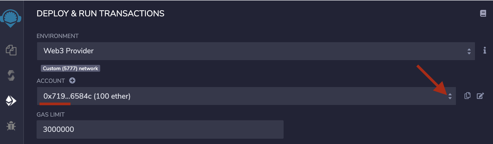

# Ethereum-tests

Tests sobre la blockchain de Ethereum

## Preparación del entorno de desarrollo

- 1.- Descargamos [Ganache](https://www.trufflesuite.com/ganache), que se trata de una interfaz de escritorio que nos permitirá monitorizar la Blockchaing local de Ethereum.

1.1 - Una vez instalado y arrancado creamos un nuevo _workspace_ y setemaos el puerto `8545`:


- 2.- Arrancamos _Remix_ que se trata de un IDE preparado para el desarrollo de _smart contracts_ sobre _Ethereum_. Para ello procederemos con el siguiente _script_

```
./run.sh
```

Ahora accederemos a REMIX a través de un navegador seteando la url `http://localhost:8080/`

2.1 Ahora le indicaremos a REMIX que nos persista los contratos escritos en _solidity_ en local. Seleccionando _connet to localhost_


2.2 Ahora le indicaremos a REMIX que deseamos conectarnos con la red de _Ganache_. Para ello en la sección de compiladores
le marcaremos la opción de `ENVIRONMENT: Web3 Provider`


Se habra conectado correctamente si en la sección de _ACCOUNT_ aparecen las mismas que en _Ganache_




- 3.- Si disponemos del Wallet [Metamask](https://metamask.io/) podremos conectarlo tmb a nuestro entorno local.


Podremos importar las cuentas que nos ha generado _Ganache_ mediante la clave privada de estas


## Contratos estandard

### Tokens ERC20 


### NFT (Non Fungible Tokens) ERC721

El __ERC721__ se trata del estandard de _Smart Contract_ en _Ethereum_ de los NFTs o _Non Fungible Tokens_. 

Las especificaciones de este _Smart Contract_ se recogen en la siguiente sección de [estándares](https://ethereum.org/en/developers/docs/standards/tokens/erc-721/) de Ethereum.

Este tipo de _token_ trata de identificar a alguien o a algo de manera única. Ejemplos de casos de uso serían: claves de acceso, tickets de lotería, el número de asientos en un concierto o elementos coleccionables entre otros.

Un ejemplo de contrato NFT bastante popular desplegado en _Ethereum_ es el de [CryptoKitties](https://etherscan.io/address/0x06012c8cf97bead5deae237070f9587f8e7a266d#code), un servicio de compra venta de [dibujitos de gatos coleccionables](https://www.cryptokitties.co/)

En este ejemplo haremos una colección de NFTs con un arte asociado.

Instalación del cliente de IPFS [Descarga](https://docs.ipfs.io/install/command-line/#official-distributions)

```bash
ipfs init
ipfs daemon
ipfs add art.png
ipfs add nft.json
```

URL de la imagen
`https://ipfs.io/ipfs/QmXYmoM1YUYgDifhgYb6jHUBjz4yurKzY6NS6VkJT5o244`

URL del json

`https://ipfs.io/ipfs/QmR1cit4Jt8cVUHKft15eP77mWr2D4qnJz5Z8W1bWWqdAD`

__Referencia__

- https://www.quicknode.com/guides/solidity/how-to-create-and-deploy-an-erc-721-nft